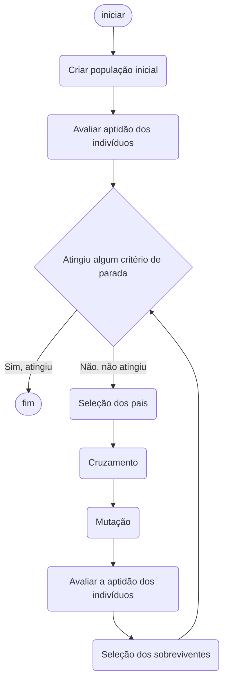

Repositório criado para armazenar o trabalho de Algoritmo Genético
### Equipe
- Júlio Oliveira
- Sávio Miranda
- Luiz Monteiro
- X
- X

# Descrição da Atividade
Desenvolva um algoritmo genético, em uma linguagem de programação de sua escolha, para resolver o problema das oito rainhas. Uitlize obrigatoriamente a codificação binária para representar os indivíduos. Os parâmetros desse algoritmo genético devem ser:
- Tamanho da população: 20
- Seleção dos pais: estrátegia da roleta
- Cruzamento: estrátegia do ponto de corte
- Taxa de cruzamento: 0.8
- Mutação: estrátegia do bit flip
- Taxa de mutação: 0.03
- Seleção de sobreviventes: elitista
- Critério de parada:
    - Número máximo de gerações alcançado: 1000
    - Se a solução ótima foi encontrada
***
### Requisitos de Entrega
1. Crie e explique um fluxograma que descreva uma busca arbitrária, considerando uma função objetivo que minimize o número de colisões entre as rainhas.
2. Execute o algoritmo 50 vezes e calcule a média e o desvio padrão do número mínimo de iterações.
3. Mostre as cinco melhores soluções distintas encontradas pelo algoritmo.
4. Anexe o link para um repositório ou arquivo zip contendo o código fonte do algoritmo desenvolvido.
***
### Fluxograma
<!-- TD para Top and Down, LR para Left Right -->
